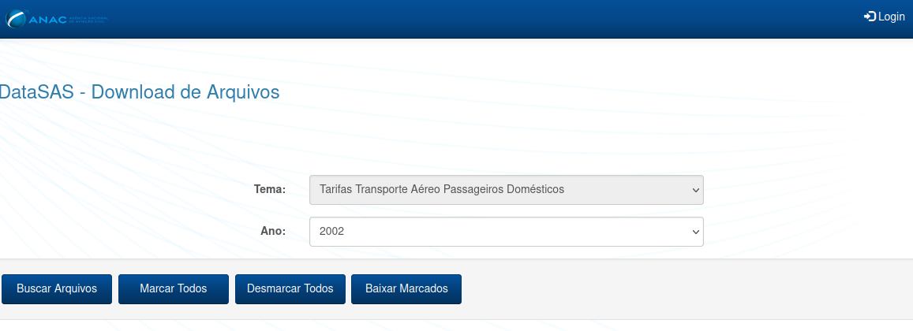
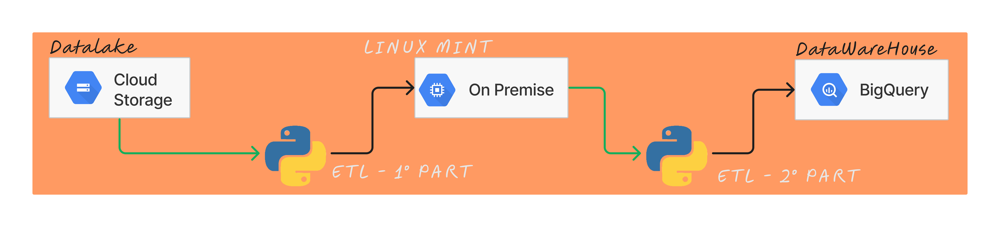
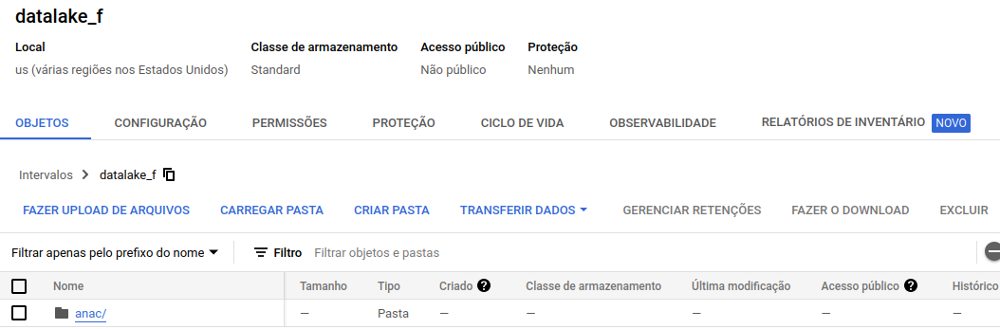
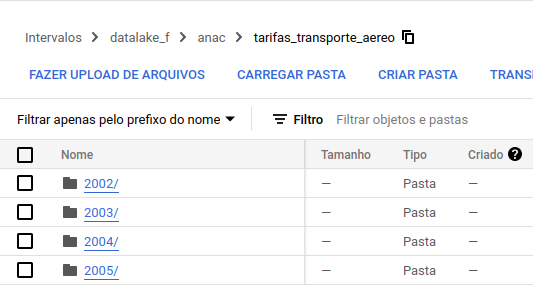
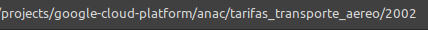

# Goal 

Application used to data transform a ANAC databases called 'Tarifas Transporte Aéreo Passageiros Domésticos' by year 2002 to 2005. Starting with a manual extract data on DataSAS (ANAC's site) to saving a datalake. Then process all data in a datalake to a datawarehouse. 

## Data pipeline

### Initial Data (Without processing)

It's getting on website, that uset to csv format.

<a href="https://sas.anac.gov.br/sas/downloads/view/frmDownload.aspx?tema=14">ANAC's Website</a>

### Infrastructure

1° Active Cloud Storage service. 
2° Active Cloud Bigquery. 
3° Creating Service Account with ADMIN bigquery ang ADMIN storage permissions. 
4° Download credential's json file.  
5° Install python3 dependencies and configure a local venv.
 

Refinements: Upgrade a local development to a docker container, then upload to a Google Cloud Platform using Cloud Run Service.

### Datalake - Cloud Storage

We're using cloud storage like a datalake, a object storage service. Extracting initial data on ANAC to datalake aren't automated. We are going to update the extract process on a second version.

### Transform - Python 

First, it's downloaded path structure of bucket according with storage and parameters of subfolders, that include from, report and year.

Then, replicate path locally:

Second, reading data in a local path according with folders and transform to a dataset. So, excluding all temporary folders that were created in process.

### Datawarehouse - Bigquery

The last one step, saving processed data after all cleaning.

Using a constant SCHEMA with all columns of table_id and there definitions (type and tech's columns) and insert like a parameters on bigquery class object. Then, post a request in a google bigquery API for checking if table_i exist or not. If table doesn't exist, it will be create. So, insert a data on a table id.
 

## Technology Used:
 

    Language: Python
        version: 3
    Structure: OPP

    APIs: 
        Datalake: google-cloud-storage
            version: 2.10.0
        DataWarehouse: google-cloud-bigquery
            version: 3.11.3 

## Configure files

### Service Account 

    1° Creating a Google Cloud Account.
    2° Making a Service Acount and save it.

    - BigQuery:
        - BigQuery Administrator
        - Data editor of BigQuery
        - Reading metadata of BQ

    - Cloud Storage:
        - Storage Administrator
        - Maker of Storage Object
        - Reading storage Object
        - Transfer user of Storage 

### DevOps' Files

    - Google Credential's json
    - Dockerfile
    - .dockerignore
    - requeriments.txt