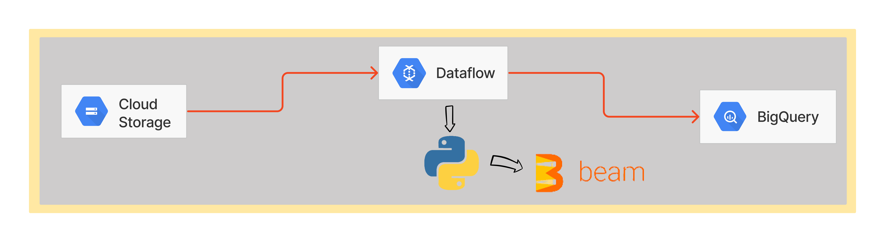
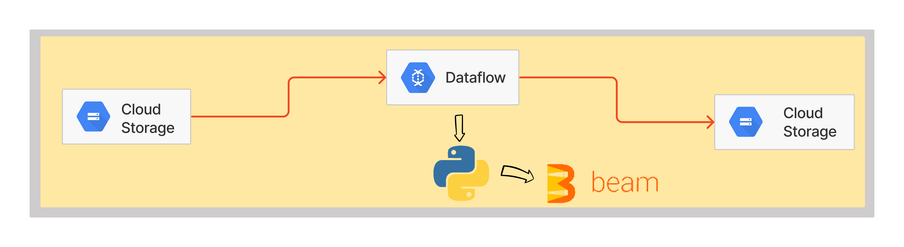

# APACHE BEAM POC

## Cloud Storage To BigQuery

This pipeline, using pipeline options definition with apache beam config arguments for know what bucket and folder in a cloud storage will catch files. Then, tranform file by file, so agroup all them to a unique dataset. The third part is to insert dataset to a bigquery table (and if this table doesn't exist, make it before push data).

 

 

1. Pipeline_options define config's parameteres of apache_beam's pipeline: 
    1.1 runner 
    1.2 project 
    1.3 job_name 
    1.4 staging_location 
    1.5 region 
    1.6 template_location 
    1.7 save_main_session 

 

    External Objects:

        1° 'filtro' Class
        2° 'criar_dict_nivel' Function
        3° 'desanimar_dict' Function
        4° 'criar_dict_nivel10' Function

 

    Beam Objects:

        1° 'tempo_Atrasos'
        2° 'qtd_Atrasos'
        3° 'tabela_atrasos'

 

## Cloud Storage To Storage

The second one, it will use another pipeline options object with parameters of apache beam for identify how bucket and how folders in this bucket would be extract. So, it will transport this files in a another folder structure in a new bucket defined in a pipeline.

 

 

1. Pipeline_options define config's parameteres of apache_beam's pipeline: 
    1.1 runner 
    1.2 project 
    1.3 job_name 
    1.4 staging_location 
    1.5 temp_location 
    1.6 region 
    1.7 template_location 

 

    External Objects:

        1° 'filtro' Class

 

    Beam Objects:

        1° 'tempo_Atrasos'
        2° 'qtd_Atrasos'
        3° 'tabela_atrasos'

